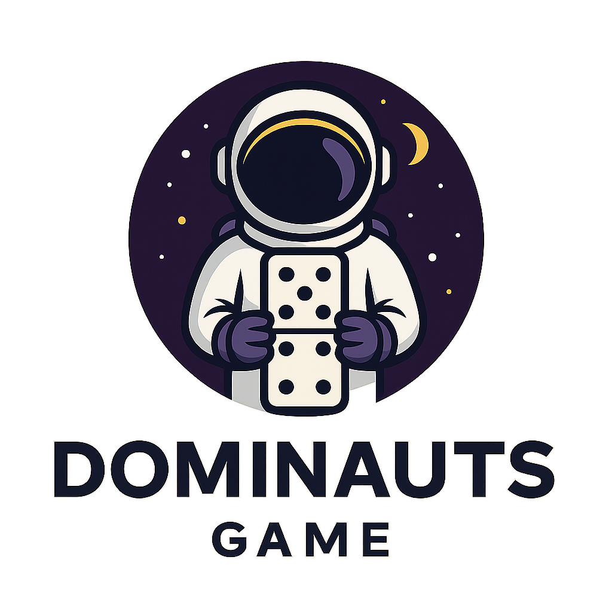

# Dominauts™ 🎮

The Ultimate Domino Gaming Experience - A professional, feature-rich domino game supporting multiple game modes, real-time multiplayer, and advanced AI opponents.



## 🌟 Features

### Game Modes
- **All Fives (Muggins)** 🇺🇸 - Score points when the sum of open ends equals a multiple of 5
- **Block Dominoes** 🟦 - Classic dominoes with no drawing
- **Cuban Dominoes** 🇨🇺 - Team-based block dominoes with double-nine set
- **Chicken Foot** 🇲🇽 - Strategic gameplay with chicken foot patterns

### Technical Features
- 🎨 **Modern UI/UX** - Responsive design with dark mode support
- 🤖 **Smart AI** - Advanced AI opponents with three difficulty levels
- 🎵 **Sound System** - Synthetic sound generation for immersive gameplay
- ✨ **Animations** - Smooth tile placement, scoring, and win animations
- 📱 **Cross-Platform** - Works on desktop, tablet, and mobile devices
- 🔥 **Firebase Integration** - Real-time multiplayer, authentication, and cloud saves
- 🎮 **Drag & Drop** - Intuitive controls with snap-to-grid functionality

## 🚀 Quick Start

### Prerequisites
- Node.js 18+ 
- npm or yarn

### Installation

1. Clone the repository:
```bash
git clone https://github.com/Paulmait/dominauts.git
cd dominauts
```

2. Install dependencies:
```bash
npm install
```

3. Start development server:
```bash
npm run dev
```

4. Open http://localhost:3000 in your browser

## 🏗️ Project Structure

```
dominauts/
├── src/
│   ├── components/     # Game components (AI, Drag&Drop)
│   ├── core/           # Core game engine and models
│   ├── modes/          # Game mode implementations
│   ├── services/       # Firebase and external services
│   ├── types/          # TypeScript type definitions
│   ├── ui/             # UI components and rendering
│   ├── utils/          # Utility functions
│   └── index.ts        # Main application entry
├── dist/               # Production build output
├── webpack.config.js   # Webpack configuration
└── package.json        # Project dependencies
```

## 🎮 How to Play

### All Fives (Muggins)
- Match tiles to open ends
- Score points when the sum of all open ends equals 5, 10, 15, 20, etc.
- Call "Muggins!" if opponent misses a scoring opportunity

### Block Dominoes
- Match tiles to open ends
- No drawing from boneyard - pass if unable to play
- First to empty hand wins the round

### Cuban Dominoes
- Played in partnerships (1&3 vs 2&4)
- Double-nine set with 10 tiles per player
- Team strategy is crucial

### Chicken Foot
- Doubles require three tiles to form a "chicken foot"
- No other plays allowed until chicken foot is complete
- Strategic blocking opportunities

## 🛠️ Development

### Available Scripts

```bash
npm run dev        # Start development server
npm run build      # Create production build
npm run typecheck  # Run TypeScript type checking
npm run lint       # Lint code
```

### Firebase Configuration

1. Create a Firebase project at https://console.firebase.google.com
2. Enable Authentication, Firestore, and Realtime Database
3. Update `src/index.ts` with your Firebase config:

```typescript
const firebaseConfig = {
  apiKey: "YOUR_API_KEY",
  authDomain: "YOUR_AUTH_DOMAIN",
  projectId: "YOUR_PROJECT_ID",
  // ... other config
};
```

## 🚢 Deployment

### Vercel
```bash
vercel
```

### Netlify
```bash
netlify deploy --prod
```

### Firebase Hosting
```bash
firebase deploy --only hosting
```

## 🎨 Customization

### Themes
The game supports light and dark modes with customizable color schemes. Edit `src/ui/ThemeManager.ts` to add new themes.

### Game Modes
Add new game modes by extending the `GameMode` class in `src/core/modes/GameMode.ts`.

### Sound Effects
Synthetic sounds are generated in `src/ui/SoundManager.ts`. Customize or add new sounds as needed.

## 📝 License

Copyright © 2024 Dominauts™. All rights reserved.

## 🤝 Contributing

Contributions are welcome! Please read our contributing guidelines before submitting PRs.

## 🐛 Bug Reports

Found a bug? Please open an issue on GitHub with:
- Description of the bug
- Steps to reproduce
- Expected vs actual behavior
- Screenshots if applicable

## 📧 Contact

- Website: https://dominauts.com
- GitHub: https://github.com/Paulmait/dominauts
- Email: support@dominauts.com

## 🙏 Acknowledgments

- Built with TypeScript, Webpack, and Firebase
- Domino game rules from various cultural traditions
- Community feedback and contributions

---

**Dominauts™** - Experience dominoes like never before! 🎲